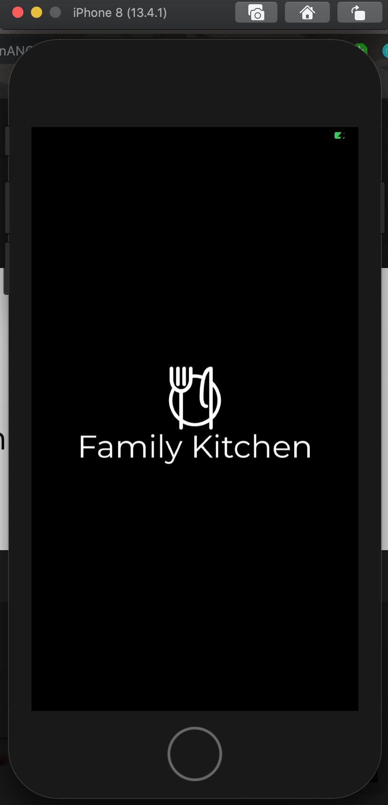
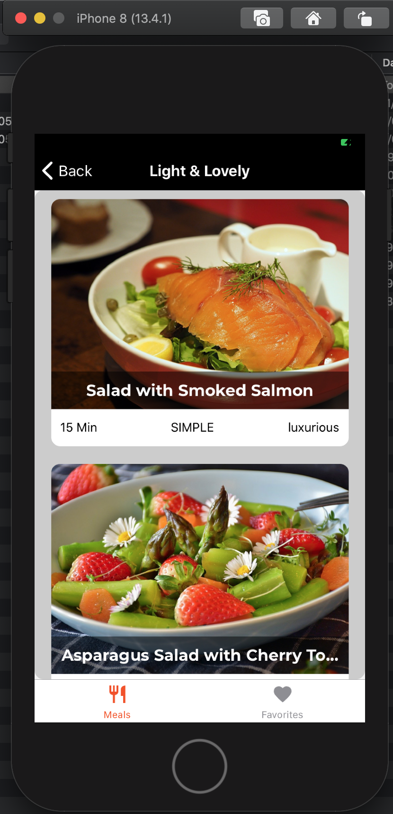

# Meals Concept

This project is being inspired by the Meals Application, which was created by [maxschwarzmueller](https://github.com/maxschwarzmueller)
in the [React Native the practical guide](https://www.udemy.com/course/react-native-the-practical-guide/).

This project contains the fundamental concepts used in every real react native project like:
 * Use Expo as framework to speed up the development
 * **React-navigation** to allow the navigation between screens
 * **Redux** to manage the application state.
   * redux-thunk middleware
   * redux-devtools-extension middleware
   * redux-logger

## Examples

### Splash

### Meals

## Dependencies

|  Dependency | Description  |
|---|---|
| [React Native](https://reactnative.dev/) | Create native apps for Android and iOS using React |
| [Expo Framework](https://expo.io/)  | With Expo tools, services, and React, you can build, deploy, and quickly iterate on native Android, iOS, and web apps from the same JavaScript codebase. |
| [Redux](https://es.redux.js.org/) | A Predictable State Container for JS Apps |

## License

MIT License

Copyright (c) 2020 Edwin Torres

Permission is hereby granted, free of charge, to any person obtaining a copy
of this software and associated documentation files (the "Software"), to deal
in the Software without restriction, including without limitation the rights
to use, copy, modify, merge, publish, distribute, sublicense, and/or sell
copies of the Software, and to permit persons to whom the Software is
furnished to do so, subject to the following conditions:

The above copyright notice and this permission notice shall be included in all
copies or substantial portions of the Software.

THE SOFTWARE IS PROVIDED "AS IS", WITHOUT WARRANTY OF ANY KIND, EXPRESS OR
IMPLIED, INCLUDING BUT NOT LIMITED TO THE WARRANTIES OF MERCHANTABILITY,
FITNESS FOR A PARTICULAR PURPOSE AND NONINFRINGEMENT. IN NO EVENT SHALL THE
AUTHORS OR COPYRIGHT HOLDERS BE LIABLE FOR ANY CLAIM, DAMAGES OR OTHER
LIABILITY, WHETHER IN AN ACTION OF CONTRACT, TORT OR OTHERWISE, ARISING FROM,
OUT OF OR IN CONNECTION WITH THE SOFTWARE OR THE USE OR OTHER DEALINGS IN THE